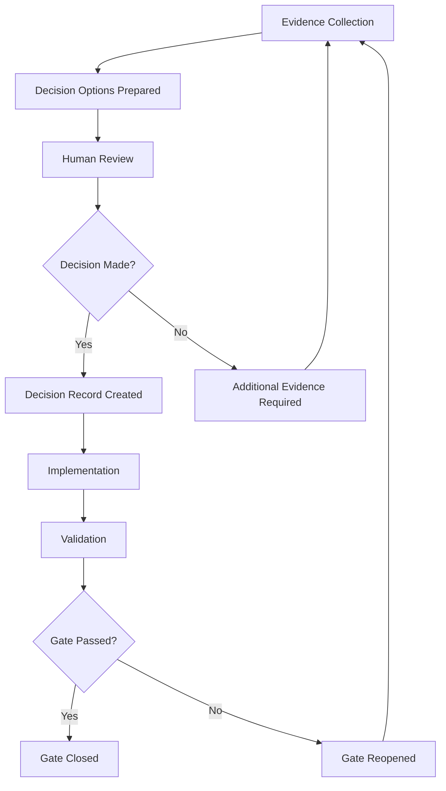

# Phase 0 Decision Gates

> **Purpose:** Define decision gates for Phase 0 Books 2-4  
> **Status:** Draft - Gate definition in progress  
> **Created:** 2026-07-31

## Gate Framework

Each decision gate requires:
1. **Evidence collection** (automatable)
2. **Decision options** (prepared by agent)
3. **Human review** (MAD or designated role)
4. **Decision record** (ADR format)
5. **Implementation** (if applicable)
6. **Validation** (verify decision respected)

---

## Gate 1: Canonical Branch Strategy (Decision 2.1)

**Status:** OPEN  
**Blocker:** Book 2 completion  
**Approval Authority:** MAD

### Pre-Gate Evidence Collection
- [ ] Current branch inventory
- [ ] Git branch history analysis
- [ ] GitHub default branch configuration
- [ ] Root README branch references
- [ ] Team collaboration workflow documentation
- [ ] CI/CD branch configuration

### Decision Options
- **Option A:** Keep `main` as canonical
  - Rationale: GitHub default, industry standard
  - Trade-offs: Conflicts with README, requires documentation update
- **Option B:** Switch to `master` as canonical
  - Rationale: README preference, historical convention
  - Trade-offs: GitHub default change, requires reconfiguration
- **Option C:** Use `develop` for active, `main` for releases
  - Rationale: Clear separation of concerns
  - Trade-offs: Additional branch management overhead

### Decision Record Template
```markdown
# ADR-001: Canonical Branch Strategy

## Context
[Problem statement and current state]

## Decision
[Selected option]

## Rationale
[Why this option]

## Consequences
- Positive: [benefits]
- Negative: [trade-offs]
- Technical: [implementation requirements]
- Operational: [workflow changes]

## Prohibited Interpretations
[What this decision does NOT mean]

## Rollback/Review Trigger
[When to reconsider]

## Approver
MAD - [date]
```

### Implementation Checklist
- [ ] Update GitHub default branch
- [ ] Update root README
- [ ] Update CI/CD configuration
- [ ] Update team documentation
- [ ] Update AGENTS.md references
- [ ] Update phase documentation
- [ ] Communicate to team

### Validation
- [ ] Git operations work on canonical branch
- [ ] CI/CD runs on canonical branch
- [ ] Documentation is consistent
- [ ] No branch references remain to old canonical

---

## Gate 2: Nautilus Dependency Strategy (Decision 3.1)

**Status:** OPEN  
**Blocker:** Book 3 completion  
**Approval Authority:** MAD

### Pre-Gate Evidence Collection
- [ ] Upstream NautilusTrader origin investigation
- [ ] Current local modifications catalog
- [ ] Dependency usage analysis
- [ ] Update frequency assessment
- [ ] License obligations review
- [ ] Package availability check (PyPI)

### Decision Options
- **Option A:** Maintain as editable local dependency
  - Rationale: Custom modifications, full control
  - Trade-offs: Manual updates, drift from upstream
- **Option B:** Switch to packaged dependency
  - Rationale: Standard dependency management, automatic updates
  - Trade-offs: Loses custom modifications, requires upstream PRs
- **Option C:** Maintain as fork with upstream sync
  - Rationale: Best of both worlds
  - Trade-offs: Fork maintenance overhead
- **Option D:** Remove, use upstream only
  - Rationale: No custom modifications needed
  - Trade-offs: Potential loss of required features
- **Option E:** Quarantine as accidental vendor
  - Rationale: Unclear intent, safety-first
  - Trade-offs: Blocks usage, requires replacement

### Implementation Checklist
- [ ] Update dependency management (pyproject.toml)
- [ ] Migrate custom modifications to separate layer
- [ ] Update import statements
- [ ] Test with new dependency strategy
- [ ] Update documentation
- [ ] Update CI/CD dependency installation

### Validation
- [ ] All imports resolve correctly
- [ ] Tests pass with new dependency
- [ ] Backtest reproduction works
- [ ] Update mechanism documented
- [ ] License compliance verified

---

## Gate 3: FX Execution Path (Decision 3.2 + 3.3)

**Status:** OPEN  
**Blocker:** Book 3 completion  
**Approval Authority:** MAD

### Pre-Gate Evidence Collection
- [ ] MT5 MCP capability analysis
- [ ] Repository search for FX scripts
- [ ] External repository investigation
- [ ] Broker/platform documentation review
- [ ] Manual process documentation
- [ ] Team inquiry for operational knowledge

### Decision Options
- **Option A:** MT5 MCP is canonical FX path
  - Rationale: Only available path, tested
  - Trade-offs: May not be production script
- **Option B:** External script identified
  - Rationale: Actual production path found
  - Trade-offs: Requires integration with repository
- **Option C:** Critical external blocker
  - Rationale: No script found, cannot proceed
  - Trade-offs: Blocks Phase 1 FX integration
- **Option D:** No FX integration planned
  - Rationale: FX not in scope
  - Trade-offs: Limits FORGE capability

### Implementation Checklist
- [ ] Classify MT5 MCP in Book 3
- [ ] Document external script location (if found)
- [ ] Create external blocker record (if none found)
- [ ] Update component classification
- [ ] Update canonical path map
- [ ] Update quarantine register (if applicable)

### Validation
- [ ] FX path classification matches evidence
- [ ] Canonical path map updated
- [ ] Quarantine policy applied (if needed)
- [ ] Blocker record complete (if external)

---

## Gate 4: Agent Authority Boundaries (Decision 3.4)

**Status:** OPEN  
**Blocker:** Book 3 completion  
**Approval Authority:** OCE Operations Director + MAD

### Pre-Gate Evidence Collection
- [ ] Agent inventory from Book 1
- [ ] Runtime evidence of agent operations
- [ ] Tool access logs
- [ ] Current config files
- [ ] Historical progress notes
- [ ] Agent-SOUL.md files review

### Decision Options
- **Option A:** Authority based on runtime evidence
  - Rationale: What agents actually do
  - Trade-offs: May not match intended design
- **Option B:** Authority based on documented claims
  - Rationale: Follow intended design
  - Trade-offs: May not match reality
- **Option C:** Revoke authority without explicit approval
  - Rationale: Safety-first, require approval
  - Trade-offs: May block legitimate operations
- **Option D:** Grant authority to demonstrated needs
  - Rationale: Support effective operations
  - Trade-offs: May increase attack surface

### Implementation Checklist
- [ ] Update agent authority matrix
- [ ] Update AGENTS.md authority sections
- [ ] Update agent SOUL.md files
- [ ] Update tool access controls
- [ ] Update governance rules
- [ ] Create authority audit trail

### Validation
- [ ] Authority matrix consistent across all docs
- [ ] Tool access matches authority
- [ ] No unauthorized operations possible
- [ ] Audit trail complete

---

## Gate 5: Canonical Classification (Decision 3.5)

**Status:** OPEN  
**Blocker:** Book 3 completion  
**Approval Authority:** Independent Validator + MAD

### Pre-Gate Evidence Collection
- [ ] Book 1 inventory
- [ ] Book 2 baseline results
- [ ] FORGE anchor compliance check
- [ ] Independent validation readiness
- [ ] Component dependency analysis

### Decision Options
- **Option A:** Strict canonical definition
  - Rationale: High quality, clear boundaries
  - Trade-offs: Fewer canonical components
- **Option B:** Permissive canonical definition
  - Rationale: More flexibility
  - Trade-offs: Lower quality, ambiguous boundaries
- **Option C:** Default to supporting until verified
  - Rationale: Conservative approach
  - Trade-offs: Slower progression to canonical

### Implementation Checklist
- [ ] Classify all components
- [ ] Update component classification registry
- [ ] Update dependency graph
- [ ] Update canonical path map
- [ ] Update quarantine register
- [ ] Create decision records for major classifications

### Validation
- [ ] All components have one primary class
- [ ] No circular dependencies
- [ ] Canonical components meet all criteria
- [ ] Quarantine rules respected

---

## Gate 6: Reality Lock Approval (Decision 4.4)

**Status:** OPEN  
**Blocker:** Phase 0 completion  
**Approval Authority:** MAD

### Pre-Gate Evidence Collection
- [ ] Complete Books 1-3 evidence
- [ ] All decision records approved
- [ ] Independent validation report
- [ ] No critical blockers
- [ ] FORGE_CONTEXT.md complete
- [ ] Phase 1 handoff ready

### Decision Options
- **Option A:** Approve
  - Rationale: All criteria met
  - Trade-offs: None
- **Option B:** Approve with conditions
  - Rationale: Minor issues, non-critical
  - Trade-offs: Phase 1 with constraints
- **Option C:** Reject
  - Rationale: Critical issues found
  - Trade-offs: Return to Books 1-3
- **Option D:** Block
  - Rationale: Unresolvable critical issues
  - Trade-offs: Phase 0 cannot complete

### Implementation Checklist
- [ ] Finalize RealityLockManifest
- [ ] Sign validation report
- [ ] Archive Phase 0 evidence
- [ ] Communicate Phase 1 readiness
- [ ] Update BUILD_STATUS.md
- [ ] Trigger Phase 1 start

### Validation
- [ ] Manifest signed and committed
- [ ] Phase 1 handoff complete
- [ ] BUILD_STATUS updated
- [ ] Team notified

---

## Gate Process Flow



---

## Gate Status Dashboard

| Gate | Status | Evidence | Decision | Implementation | Validation |
|------|--------|---------|---------|---------------|------------|
| 1: Canonical Branch | OPEN | Pending | Pending | Pending | Pending |
| 2: Nautilus Strategy | OPEN | Pending | Pending | Pending | Pending |
| 3: FX Path | OPEN | Pending | Pending | Pending | Pending |
| 4: Agent Authority | OPEN | Pending | Pending | Pending | Pending |
| 5: Canonical Classification | OPEN | Pending | Pending | Pending | Pending |
| 6: Reality Lock | OPEN | Pending | Pending | Pending | Pending |

---

## Next Actions

1. **Immediate:** Present Gate 1 (Canonical Branch) to MAD for initial guidance
2. **Parallel:** Begin evidence collection for Gate 2 (Nautilus Strategy)
3. **Sequential:** Execute gates in priority order
4. **Documentation:** Create ADR templates for each gate
5. **Process:** Establish approval workflow with MAD

---

**Status:** Decision gates defined. Ready for gate execution process.