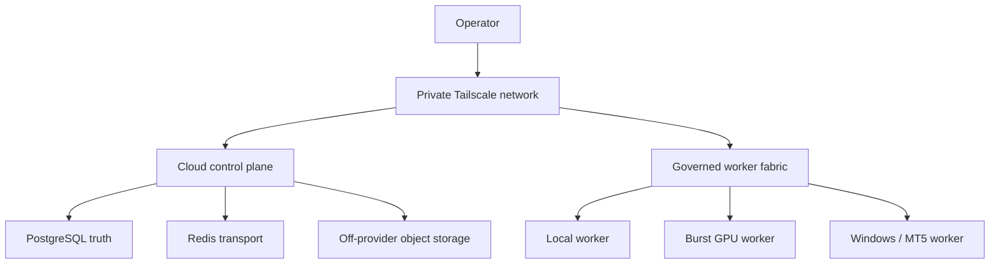

# OCE Golden System
## Block 1 — Cloud Ground Planning Dossier

**Document ID:** OCE-B1-PLAN-001  
**Version:** 1.0  
**Status:** RATIFIED PLANNING BASELINE — LIMITED BUILD AUTHORIZATION  
**Owner and final authority:** Operator  
**Parent authorities:** OCE Golden System Architecture Constitution 1.1; OCE Master Program Atlas 1.0; Block 0 Constitutional Control Plan 1.0  
**Planning date:** 2026-08-17  
**Price observation date:** 2026-08-17  
**Build authorization:** B1-I1 static infrastructure repository skeleton only  
**Purchase authorization:** None  
**Git status:** Ready for the next reviewed planning checkpoint; not yet pushed in this session  
**Operator ratification basis:** “OK CONTINUE WITH NEXT STEPS” — 2026-08-20  
**Next permitted action:** Execute B1-I1 on a dedicated working branch; do not purchase, provision, expose, or deploy cloud resources

---

## 0. How This Dossier Is Used

This dossier converts Block 1 from a five-line program map into a complete, reviewable infrastructure contract. It defines the ground on which OCE, PO, later applications, and eventually quant systems may stand. It does not purchase a server, create an account, deploy a service, expose a port, or change OCE code.

Block 1 contains five chapters and twenty-five sections:

1. **B1.C1 Capacity and Economics** — choose an honest workload and cost envelope;
2. **B1.C2 Trust Boundary** — make the ground private, attributable, and recoverable;
3. **B1.C3 Durable Data** — establish operational truth, artifacts, backup, and restore;
4. **B1.C4 Runtime** — make deployment repeatable, observable, and reversible;
5. **B1.C5 Worker Fabric** — connect local and burst compute without giving workers the keys to the castle.

Every section has completed **Frame → Interrogate → Simulate → Refine** and was ratified by the operator’s instruction to continue on 2026-08-20. Ratification freezes the planning contract; it does not prove implementation capability.

### 0.1 Status vocabulary

| Status | Meaning |
|---|---|
| MAPPED | Architectural location only. |
| FRAMED | Purpose, boundaries, inputs, and questions are explicit. |
| INTERROGATED | Assumptions, failure modes, contradictions, and alternatives have been challenged. |
| SIMULATED | Normal, failure, restart, abuse, and change scenarios were walked through. |
| RATIFIED | The proposed contract incorporates those findings. |
| READY_FOR_REVIEW | All required dossiers and block-level audits exist for operator review. |
| RATIFIED | The operator accepts the contract. |
| BUILDING | Explicitly authorized implementation is in progress. |
| VERIFYING | Implementation exists and is being tested against the ratified contract. |
| GATED_COMPLETE | Evidence satisfies the exit gate and the operator accepts the result. |

### 0.2 Five artifact families

This single review file contains the five required artifact families as explicit parts:

1. Block Charter;
2. Chapter and Section Dossiers;
3. Decision Register;
4. Evidence Pack and Gate Specification;
5. Build Learning Ledger.

During implementation they may become separate files, but their identifiers and lineage must remain intact.

---

# Part I — Block Charter

## 1. Purpose

Block 1 creates a light, private, durable operating base that removes the operator’s computer as the sole host and source of operational truth. “Light” means low fixed cost and low operational ceremony. It does not mean weak, disposable, or unverified.

The chosen ground must support one highly active operator, not a public multi-tenant product. Scale is therefore measured by workload intensity, build concurrency, data volume, recovery needs, and burst compute—not by user count.

## 2. Castle role

Block 1 is the land, utilities, vault, roads, and guarded gates of the castle. OCE remains the constitutional and orchestration spine. PO remains a future governed builder. Applications and quant systems remain upper floors. Infrastructure may carry their work but may not absorb their domain authority.

## 3. In scope

- a costed always-on host baseline and evidence-based growth trigger;
- private network, operator access, service identity, firewall, and break-glass control;
- PostgreSQL operational truth, bounded Redis use, artifact storage, backup, and restore proof;
- reproducible host configuration, containers, secrets, observability, upgrades, and rollback;
- governed local, OctaSpace, RunPod, and Windows/MT5 worker connection contracts;
- a clean-deployment and recovery evidence specification usable by a non-coder operator;
- cost, security, durability, and reversibility guardrails.

## 4. Out of scope

- buying or provisioning infrastructure before ratification and explicit authorization;
- claiming OCE/PO functionality that Block 2 has not reality-sealed;
- redesigning OCE, PO, Cerebus, Quant Lab, or Quant Watch;
- production trading, broker credentials, autonomous capital action, or live MT5 execution;
- Kubernetes, multi-region high availability, enterprise IAM, or public multi-tenancy;
- treating a provider snapshot, a test pass, or a running container as proof of recoverability;
- moving the entire 25 GB workspace blindly into an always-on server.

## 5. Inputs and dependencies

Block 1 depends on Block 0 being GATED_COMPLETE. Its evidence inputs are the operator’s workload posture, the existing 25 GB workspace constraint, provider documentation, current price observations, and the future Block 2 repository audit. Unknown application requirements remain unknown; the infrastructure therefore exposes clean contracts without pretending to know the final application shape.

## 6. Binding design principles

1. **Operational truth survives the laptop.** Important state is server-side and backed up off-server.
2. **The control plane is boring and durable.** Heavy, uncertain, or GPU work is isolated in workers.
3. **Private first.** Public exposure is an exception requiring a named need and a reviewable path.
4. **PostgreSQL is truth; Redis is transport.** Queue loss may delay work but may not erase accepted intent.
5. **Workers are disposable executors.** They receive bounded tasks, not standing authority.
6. **Restore is the proof of backup.** A green backup job without a clean restore is an unverified claim.
7. **Pinned, reproducible, reversible.** Configuration is versioned; releases can be rolled back.
8. **Cost is governed like capability.** Fixed and burst spending have explicit ceilings and stop conditions.
9. **No invisible success.** The operator receives plain-language state, evidence, and recovery instructions.
10. **No observation is trash; no hazardous payload is sacred.** Infrastructure attempts and failures enter the learning lifecycle with safe disposition.

## 7. Target architecture decision

Subject to price and availability revalidation at purchase time, the recommended baseline is:

- **Always-on host:** netcup RS 4000 G12, one server;
- **Operating system:** Ubuntu Server 24.04 LTS minimal, patched and version-pinned through configuration;
- **Deployment:** Docker Engine plus Compose; Ansible as authoritative host configuration; OpenTofu only where provider support is reliable;
- **Private network:** Tailscale Personal with role tags and least-privilege policy;
- **Ingress:** Tailscale-only during Block 1; Caddy reserved as the controlled reverse-proxy boundary if public UI/API ingress is later approved;
- **Truth store:** PostgreSQL, pinned to a compatibility-approved supported major;
- **Transport/cache:** Redis, pinned to a compatibility-approved release and prohibited from being sole durable truth;
- **Artifacts:** Cloudflare R2 for portable artifact exchange initially; off-compute-provider encrypted backup target, with Backblaze B2 evaluated as a second or alternative target;
- **Heavy compute:** outbound-connected local workers first; OctaSpace admitted as an experimental ephemeral GPU pool; RunPod as a more standardized fallback;
- **Windows/MT5:** isolated Windows worker with no direct database credentials and no live capital authority in Block 1;
- **Observability:** structured logs, health/readiness endpoints, host/container/database metrics, cost and backup signals;
- **Orchestration:** no Kubernetes in Block 1.

This decision optimizes for a powerful single-operator laboratory with low fixed cost and portable components. It does not claim enterprise availability.

## 8. Exit gate

Block 1 may become GATED_COMPLETE only after all of the following are demonstrated from a clean starting point:

- a documented, repeatable deployment creates the approved host baseline;
- operator access works privately and unauthorized public access is denied;
- PostgreSQL persists accepted state through service and host restart;
- Redis loss does not erase accepted jobs or authoritative state;
- encrypted off-server backups complete and a clean restore is proven;
- service health, readiness, resource, backup, and cost state are operator-legible;
- at least one local worker passes the governed admission test;
- one disposable burst worker completes an artifact round trip without permanent secrets;
- the Windows/MT5 boundary is either proven in paper/shadow mode or explicitly deferred without weakening other gates;
- upgrade and rollback drills pass;
- actual monthly run rate and burst exposure remain inside the ratified budget;
- the Gate Report recommends ADVANCE and the operator accepts it.

---

# Part II — Provider Evidence and Economic Decision

## 9. Point-in-time price comparison

Prices below are planning observations as of 2026-08-17. “From” prices, taxes, IPv4 charges, regions, hardware availability, currency conversion, and transfer charges can change. The purchase gate must re-price the exact configuration.

| Provider / shape | Advertised capacity | Observed monthly or hourly price | Planning interpretation |
|---|---:|---:|---|
| netcup RS 4000 G12 | 12 dedicated AMD EPYC cores, 32 GB ECC, 1 TB NVMe | €39.92/mo incl. 19% VAT | Recommended always-on baseline: unusually strong CPU, memory, and local storage per dollar. |
| netcup RS 8000 G12 | 16 dedicated cores, 64 GB ECC, 2 TB NVMe | €71.36/mo incl. VAT | Evidence-triggered scale-up, not the starting default. |
| OVHcloud VPS-4 | 8 vCores, 24 GB RAM, 200 GB NVMe | $23.37/mo | Strong low-cost pilot/fallback, but shared compute and materially less storage/RAM. |
| Hetzner CX53 EU | shared cost-optimized x86 cloud | €29.49/mo excl. VAT/IPv4 | Cheap general host; shared CPU makes it less deterministic than RS 4000. |
| Hetzner CAX41 EU | ARM cloud | €40.99/mo excl. VAT/IPv4 | Good economics only after full ARM compatibility is proven. |
| DigitalOcean Basic | 8 vCPU, 16 GiB, 320 GiB | $96/mo | Easier managed ecosystem, but weaker value for this workload. |
| DigitalOcean CPU-optimized | 8 vCPU, 16 GiB, 100 GiB | $168/mo | Predictable CPU at a much higher fixed cost. |
| DigitalOcean General Purpose | 8 vCPU, 32 GiB, 100 GiB | $252/mo | Similar RAM class, far higher cost and much less local storage. |
| Azure D8as v5 reference | 8 vCPU, 32 GiB | about $283.97/mo PAYG | Enterprise ecosystem; re-price exactly if selected. |
| Google n2-standard-8 reference | 8 vCPU, 32 GB | $0.4467428/hr, about $326/mo before disk/egress | Enterprise ecosystem; not price-leading for the one-user baseline. |
| AWS m7a.2xlarge | 8 vCPU, 32 GiB | region-dependent dynamic pricing | Strong ecosystem; calculator required; not selected for baseline economics. |

### 9.1 Burst GPU observations

| Provider / GPU | Observed price | Use in Block 1 |
|---|---:|---|
| OctaSpace H100 80 GB | from $0.12/hr | Experimental only; price and host availability are marketplace-variable. |
| OctaSpace RTX 4080 | from $0.15/hr | Cheap disposable experiment. |
| OctaSpace RTX 4090 | from $0.26/hr | Cheap disposable experiment. |
| OctaSpace RTX A6000 | from $0.20/hr | Cheap high-VRAM experiment. |
| RunPod RTX A5000 Community | $0.27/hr | Standardized low-cost fallback. |
| RunPod RTX 4090 Community | $0.74/hr | Standardized high-performance fallback. |
| RunPod A100 PCIe 80 GB | $1.39/hr | Explicit high-memory burst only. |
| RunPod H100 PCIe | $2.89/hr | Explicit exceptional workload only. |

OctaSpace is a decentralized marketplace in which individual providers set prices and offer heterogeneous Docker or KVM capacity. That makes it economically compelling for revocable burst tasks, but unsuitable as the sole authoritative control plane. RunPod costs more in the sampled shapes but provides a more standardized fallback and published storage prices.

## 10. Baseline monthly envelope

The initial budget is governed as an envelope, not a promise that every month will hit the ceiling.

| Component | Planning allowance | Rule |
|---|---:|---|
| netcup RS 4000 G12 | €39.92/mo incl. VAT | Revalidate region, tax, setup, IPv4, and availability before purchase. |
| Private network | $0 | Tailscale Personal fits one operator and the planned resource count. |
| Artifact/backup storage | $1–$10/mo initially | Usage measured; independent of compute provider. |
| Domain/DNS | $0–$2/mo equivalent | Optional during private-only Block 1. |
| Self-hosted monitoring | $0 license cost | Resource consumption remains measured. |
| Default burst budget | $25/mo | Workers terminate after task or idle timeout. |
| Burst hard stop | $50/mo | Further spend requires operator approval. |
| Fixed-baseline warning | $60/mo equivalent | Investigate before adding recurring services. |
| Total monthly approval gate | $100/mo equivalent | No recurring or burst commitment beyond this without explicit operator decision. |

Expected starting run rate is approximately **$50–$85 equivalent per month**, depending on storage and burst use. RS 8000 shifts the expected band toward approximately **$90–$120 equivalent** before unusual burst work.

## 11. Decision rationale

The RS 4000 baseline wins because the operator is the only user but routinely pushes builds hard. Dedicated cores, 32 GB ECC, and 1 TB NVMe provide room for the always-on OCE ground, databases, observability, and bounded build coordination without paying major-cloud premiums. OVH VPS-4 is the preferred cheaper pilot or emergency fallback. Hetzner remains a credible alternative, but its shared cost-optimized shapes and 2026 pricing reduce the advantage for this particular control-plane workload.

Major clouds remain optional future integrations when a workload specifically benefits from managed services, IAM, regional availability, or credits. They are not the default place to pay $250–$350+ monthly for a comparable 8-vCPU/32-GB class before disk and egress.

## 12. Evidence sources

- [OctaSpace marketplace and advertised GPU prices](https://octa.space/)
- [OctaSpace architecture and provider documentation](https://docs.octa.space/)
- [netcup Root Server G12 specifications and prices](https://www.netcup.com/en/server/root-server)
- [OVHcloud VPS prices and included features](https://www.ovhcloud.com/en/vps/)
- [Hetzner price adjustment effective 2026-06-15](https://docs.hetzner.com/general/infrastructure-and-availability/price-adjustment/)
- [Hetzner Object Storage](https://www.hetzner.com/storage/object-storage/)
- [DigitalOcean Droplet pricing](https://www.digitalocean.com/pricing/droplets)
- [Azure pricing reference containing D8as v5](https://azure.microsoft.com/en-us/pricing/details/openshift/)
- [Google Compute Engine N2 machine specifications](https://docs.cloud.google.com/compute/docs/general-purpose-machines)
- [Google service price reference containing n2-standard-8](https://cloud.google.com/products/gemini-enterprise-agent-platform/pricing)
- [AWS M7a instance specifications](https://aws.amazon.com/ec2/instance-types/m7a/)
- [AWS EC2 On-Demand pricing method](https://aws.amazon.com/ec2/pricing/on-demand/)
- [RunPod GPU pricing](https://www.runpod.io/pricing)
- [RunPod storage pricing](https://www.runpod.io/product/cloud-gpus)
- [Cloudflare R2 pricing](https://developers.cloudflare.com/r2/pricing/)
- [Backblaze B2 pricing](https://www.backblaze.com/cloud-storage/pricing)
- [Tailscale Personal plan](https://tailscale.com/pricing)

---

# Part III — Chapter and Section Register

## 13. Block 1 map

| Chapter | Section | Name | Planning status | Primary contract |
|---|---|---|---|---|
| B1.C1 | B1.C1.S1 | Workload envelope | RATIFIED | Control-plane and worker resource boundary |
| B1.C1 | B1.C1.S2 | RS 4000 baseline | RATIFIED | Initial host decision |
| B1.C1 | B1.C1.S3 | RS 8000 growth trigger | RATIFIED | Evidence-based scale-up rule |
| B1.C1 | B1.C1.S4 | Burst-compute budget | RATIFIED | Disposable compute spending and lifecycle |
| B1.C1 | B1.C1.S5 | Cost guardrails | RATIFIED | Warning, stop, approval, and review controls |
| B1.C2 | B1.C2.S1 | Private network | RATIFIED | Tailscale trust fabric |
| B1.C2 | B1.C2.S2 | Operator access | RATIFIED | Human authentication and administration |
| B1.C2 | B1.C2.S3 | Service identity | RATIFIED | Machine attribution and least privilege |
| B1.C2 | B1.C2.S4 | Firewall and exposure | RATIFIED | Deny-by-default ingress contract |
| B1.C2 | B1.C2.S5 | Break-glass access | RATIFIED | Audited emergency recovery path |
| B1.C3 | B1.C3.S1 | PostgreSQL | RATIFIED | Durable operational truth |
| B1.C3 | B1.C3.S2 | Redis boundary | RATIFIED | Transient transport/cache boundary |
| B1.C3 | B1.C3.S3 | Artifact storage | RATIFIED | Portable object and manifest contract |
| B1.C3 | B1.C3.S4 | Backup policy | RATIFIED | Encrypted retention and RPO contract |
| B1.C3 | B1.C3.S5 | Restore proof | RATIFIED | Clean-room recovery gate |
| B1.C4 | B1.C4.S1 | Host baseline | RATIFIED | Minimal reproducible OS contract |
| B1.C4 | B1.C4.S2 | Containers and supervision | RATIFIED | Compose runtime and lifecycle |
| B1.C4 | B1.C4.S3 | Secrets | RATIFIED | Secret creation, delivery, rotation, and revocation |
| B1.C4 | B1.C4.S4 | Observability | RATIFIED | Operator-legible health and evidence |
| B1.C4 | B1.C4.S5 | Upgrade and rollback | RATIFIED | Reversible change contract |
| B1.C5 | B1.C5.S1 | Local worker | RATIFIED | Outbound-only trusted execution edge |
| B1.C5 | B1.C5.S2 | OctaSpace experiment | RATIFIED | Untrusted-marketplace burst adapter |
| B1.C5 | B1.C5.S3 | RunPod fallback | RATIFIED | Standardized burst fallback |
| B1.C5 | B1.C5.S4 | Windows/MT5 isolation | RATIFIED | Segregated broker-platform boundary |
| B1.C5 | B1.C5.S5 | Worker admission test | RATIFIED | Common evidence gate for every worker class |

All twenty-five planning sections are RATIFIED. Block 1 is not GATED_COMPLETE because implementation evidence does not yet exist.

---

# Part IV — B1.C1 Capacity and Economics

## B1.C1 Chapter contract

Capacity is governed by measured workload and recovery needs, not by the temptation to buy the largest machine or the cheapest advertised unit. The control plane must remain responsive when workers are busy. Heavy work belongs off the control plane by default.

### B1.C1.S1 — Workload envelope

**Purpose and value.** Define what the ground must carry without claiming knowledge Block 2 has not yet established.

**Present truth.** There is one operator, an existing workspace of roughly 25 GB, strong build/research intensity, and a need to stop relying on the local computer as the only durable host. Exact OCE service memory, CPU, data, and concurrency demands remain UNVERIFIED until Block 2.

**Target behavior.** The always-on control plane carries API/UI boundaries, scheduler/coordination, PostgreSQL, Redis transport, observability, backup agents, manifests, and modest build tasks. CPU-heavy backtests, model training, bulk ingestion, large compilation, and GPU work route to governed workers. A single job cannot consume resources required for health, database durability, or operator control.

**Authority and contract.** The operator sets cost and risk limits. The scheduler may place work only within a ratified resource class. Every job declares CPU, memory, storage, time, network, sensitivity, and expected artifact size before admission.

**Invariants and prohibited states.** No unbounded job; no job whose resource class is absent; no large raw data copied to the host without lifecycle rules; no control-plane starvation counted as “high utilization success.”

**Scenarios.** Normal: services remain responsive while local/burst workers execute. Failure: a worker dies and durable job state remains reconcilable. Restart: host reboot restores control services before worker dispatch. Abuse: a task requests unlimited memory or privileged containers and is denied. Change: measured demand updates the envelope through a decision record.

**Acceptance evidence.** A machine-readable resource-class catalog; stress test reserving headroom; dashboard showing CPU, memory, disk, I/O, queue, and database pressure; operator-readable explanation of what runs where.

**Exit condition.** P95 control-plane CPU below 70%, memory below 75%, disk below 70%, and database/interactive latency inside the ratified SLO during a representative worker workload—or explicit evidence that different thresholds are safer.

**Learning hook.** Record estimates versus measured use by workload class so future PO planning learns realistic resource requests.

### B1.C1.S2 — RS 4000 baseline

**Purpose and value.** Freeze one powerful, economical starting shape and avoid provider indecision.

**Decision.** Prefer netcup RS 4000 G12: 12 dedicated cores, 32 GB DDR5 ECC, 1 TB NVMe, observed at €39.92/month including 19% VAT. Exact region, provisioning terms, IPv4, setup charges, stock, and final tax must be revalidated.

**Why this shape.** It gives the one-user system room for durable services and bounded experimentation while costing far less than comparable major-cloud general-purpose instances. Dedicated cores reduce noisy-neighbor uncertainty. One TB local NVMe accommodates the current workspace class without making local disk the only copy.

**Alternatives.** OVH VPS-4 is the cost-minimizing pilot/fallback. Hetzner CX53 is an alternate shared host. ARM is rejected until all required images and native dependencies pass compatibility tests. Major clouds are deferred absent a workload-specific advantage.

**Prohibited interpretation.** The host is not permission to run every workload locally, store every artifact forever, or claim 99.9% provider availability as end-to-end OCE reliability.

**Acceptance evidence.** Purchase-time quote, CPU virtualization/dedication check, storage benchmark, network/region check, clean deployment, 24-hour soak, and resource-reservation stress test.

**Exit condition.** The baseline satisfies the Chapter C1 envelope and all security/durability gates within the fixed-cost warning line.

**Learning hook.** Capture advertised versus observed CPU, disk, network, provisioning, support, and cost.

### B1.C1.S3 — RS 8000 growth trigger

**Purpose and value.** Prevent both premature spending and late emergency scaling.

**Decision.** RS 8000 G12 is a pre-approved architectural option but not a pre-authorized purchase. Scale-up requires at least one sustained trigger plus a comparison against moving the offending workload to workers.

**Triggers.** Any of the following observed for 14 days or in two representative peak cycles may open review: memory above 75% P95 after leak/cache analysis; CPU saturation or runnable queue above the agreed interactive threshold; database I/O or working-set pressure that harms SLOs; governed local storage above 70% after lifecycle cleanup; restore time exceeding RTO because of data size; or repeated need for more than two CPU-heavy colocated workers.

**Decision test.** Before scaling, identify the bottleneck, remove accidental waste, test worker separation, calculate migration downtime and monthly delta, and state which future trigger RS 8000 resolves. A larger server cannot repair bad queueing, memory leaks, missing retention, or poor queries.

**Failure/restart.** If capacity risk becomes acute, stop lower-priority work before risking database integrity. Migration requires fresh backup, tested restore, rollback window, and the old host retained until verification.

**Acceptance evidence.** Fourteen-day metrics, bottleneck report, alternatives comparison, cost impact, migration rehearsal, and operator approval.

**Exit condition.** A documented scale/no-scale decision exists; automatic purchase is prohibited.

**Learning hook.** Record which estimates under- or over-predicted actual load and feed the correction into resource-class planning.

### B1.C1.S4 — Burst-compute budget

**Purpose and value.** Make large compute available without turning cheap hourly advertising into uncontrolled spend or data exposure.

**Contract.** Burst workers have a declared provider, GPU/CPU class, maximum runtime, maximum dollars, idle timeout, task sensitivity class, output manifest, and termination proof. Default monthly budget is $25; hard stop is $50 without operator approval. Per-job estimated cost appears before dispatch.

**Provider posture.** OctaSpace is experimental and lower-trust because provider hosts and prices are heterogeneous. RunPod is the standardized fallback. Neither receives permanent control-plane or database credentials. Sensitive workloads can be restricted to local workers.

**Failure/abuse.** Orphaned instances, retry storms, storage left attached, and hidden idle fees are cost incidents. Dispatch stops when metering is stale, provider status is unknown, or the budget ledger cannot reconcile.

**Acceptance evidence.** Preflight estimate, budget reservation, provider job ID, heartbeat, idle termination, final invoice reconciliation, artifact checksum, and deletion/termination receipt.

**Exit condition.** A deliberately failed burst job cannot exceed its per-job ceiling and leaves no standing secret or billable compute.

**Learning hook.** Normalize cost per successful workload unit, not just per GPU hour.

### B1.C1.S5 — Cost guardrails

**Purpose and value.** Treat money as a governed resource and make surprises visible before they compound.

**Contract.** Costs are classified as fixed, variable, burst, storage, transfer, backup, domain, and exceptional. The monthly ledger records forecast, reserved exposure, actual, variance, owner, and evidence link.

**Thresholds.** Fixed-baseline warning at $60 equivalent; burst hard stop at $50; total recurring/variable approval gate at $100. Currency conversion and taxes are included in actuals. Any new recurring service requires a decision record even if individually cheap.

**Failure/abuse.** Missing telemetry is not zero cost. Retry loops, forgotten volumes, snapshot accumulation, egress, premium IPs, and overlapping migrations are explicitly monitored. If cost state is stale, new burst dispatch pauses.

**Acceptance evidence.** Provider budgets/alerts where available, OCE-side ledger, weekly reconciliation during Block 1, forecast-versus-actual report, and a tested stop procedure.

**Exit condition.** The operator can see current run rate, worst-case committed exposure, top drivers, and exact services to stop without needing provider-console archaeology.

**Learning hook.** Link cost outcomes to task types, providers, failures, and useful outputs so later PO plans optimize total verified outcome cost.

---

# Part V — B1.C2 Trust Boundary

## B1.C2 Chapter contract

The ground is private by default. Identity precedes connectivity; connectivity does not imply authority. Human, service, and worker access are separately attributable, revocable, and observable.

### B1.C2.S1 — Private network

**Purpose and value.** Create one encrypted address space across the operator, cloud control plane, local workers, and admitted burst/Windows workers without publishing internal services.

**Decision.** Use Tailscale as the initial private fabric. Define tags or equivalent roles for `operator`, `control`, `worker-local`, `worker-burst`, `worker-windows`, and `backup`. Default policy denies cross-role communication unless a named contract permits it.

**Allowed paths.** Operator may administer control services; workers may call only the worker task/artifact interfaces; backup identity may write to the backup path and read only when restore is authorized; databases and Redis remain control-plane private.

**Failure/abuse.** Tailnet control failure must not corrupt services; it may deny new access. A compromised worker cannot laterally reach PostgreSQL, Redis, SSH, or another worker. Expired ephemeral nodes are removed.

**Acceptance evidence.** Versioned policy, topology inventory, positive path tests, negative path tests, node-expiry test, packet/port scan from every role, and operator-readable map.

**Exit condition.** Every required path works and every prohibited path demonstrably fails.

**Learning hook.** Record denied connections and policy corrections without treating repeated denial as proof that access should be granted.

### B1.C2.S2 — Operator access

**Purpose and value.** Give the sole operator clear, strong, recoverable administrative access without normalizing shared roots or public SSH.

**Contract.** Administrative access travels through the private network, uses a named non-root account, key-based authentication, MFA on provider and network accounts, and privilege elevation only when needed. Direct root login and password SSH are disabled.

**Usability.** A one-page operator runbook covers normal login, health review, service restart, backup status, cost status, and escalation. Commands are wrapped in safe scripts or documented checks where practical so success is visible to a non-coder.

**Failure/abuse.** Lost device revokes that device identity. Repeated login failure alerts. Session and privilege events are logged. Routine access must never depend on the break-glass secret.

**Acceptance evidence.** Successful private login, failed public login, failed password/root attempts, MFA proof, device revocation drill, and runbook walkthrough.

**Exit condition.** The operator can perform normal administration from an enrolled device and can explain how access is revoked.

**Learning hook.** Capture confusing or error-prone operator steps as usability defects, not operator incompetence.

### B1.C2.S3 — Service identity

**Purpose and value.** Ensure every machine action is attributable and constrained instead of hiding behind shared credentials.

**Contract.** Each service and worker class receives a distinct identity, minimal permissions, scope, issuer, creation time, expiry/rotation rule, and revocation path. Identity and authorization are separate: a known worker may still be denied a task.

**Secrets boundary.** Workers receive short-lived, task-scoped credentials or signed grants. Database credentials are service-specific. Backup credentials cannot administer compute. Monitoring credentials are read-only.

**Failure/abuse.** Shared all-powerful `.env` files, permanent cloud keys in images, copied database passwords, and identity reuse across environments are prohibited. Revocation must stop new work without rewriting the whole system.

**Acceptance evidence.** Identity registry, permission matrix, expiry test, revocation test, attempted cross-service access, and audit attribution.

**Exit condition.** A leaked worker credential has a bounded blast radius and can be revoked independently.

**Learning hook.** Record every permission expansion with the denied operation that motivated it and the narrower alternatives considered.

### B1.C2.S4 — Firewall and exposure

**Purpose and value.** Make network denial an enforceable layer even if an application binds incorrectly.

**Decision.** Host firewall denies unsolicited ingress. During Block 1, SSH, UI, API, PostgreSQL, Redis, metrics, and administration are Tailscale-only. Public ports remain closed unless the operator ratifies a concrete public UI/API need; PostgreSQL, Redis, SSH, and monitoring are never directly public.

**Public exception.** If later approved, only Caddy on 80/443 may face the internet, with TLS, authentication, rate limits, request-size/time limits, and no direct route to internal administration. Exposure has an owner, purpose, review date, and rollback.

**Failure/abuse.** Container port publishing may not bypass the host policy. Installation defaults are scanned. Outbound access is recorded and narrowed where practical; unexpected destinations trigger review.

**Acceptance evidence.** External and tailnet port scans, container-bind inspection, firewall persistence after reboot, public-exception rollback test, and documented expected listeners.

**Exit condition.** Only ratified interfaces are reachable from each network zone.

**Learning hook.** Unexpected listeners become security observations with dispositions, even when benign.

### B1.C2.S5 — Break-glass access

**Purpose and value.** Recover when Tailscale, normal credentials, or host policy fails without leaving a permanent back door.

**Contract.** Provider console/rescue is the primary emergency path. A separately protected one-time emergency credential and a concise recovery runbook identify when break-glass is allowed, who authorizes it, what actions are permitted, and how normal controls are restored.

**Use sequence.** Declare incident; record reason and intended scope; use provider console; recover network/identity or data; capture actions; revoke/rotate emergency material; verify normal access; issue post-incident record.

**Failure/abuse.** Break-glass may not become routine maintenance. Its secret is not stored plaintext on the same host or in ordinary repository configuration. Every use triggers rotation and review.

**Acceptance evidence.** Controlled drill from loss of normal access through restoration, including timing, logs, credential rotation, and proof that emergency access is closed.

**Exit condition.** The operator can recover access inside the infrastructure RTO without creating an untracked permanent privilege path.

**Learning hook.** Drill friction and undocumented provider behavior become amendments to the runbook and provider risk record.

---

# Part VI — B1.C3 Durable Data

## B1.C3 Chapter contract

Data durability is a demonstrated lifecycle: accept, commit, identify, back up, restore, reconcile, retain, and delete safely. Local NVMe improves performance; it does not remove the need for off-server recovery.

### B1.C3.S1 — PostgreSQL

**Purpose and value.** Establish one durable operational truth store for accepted intents, jobs, state transitions, identities, decisions, manifests, and evidence references.

**Contract.** PostgreSQL is the authoritative transaction store. A job or change is not accepted until its durable record commits. Schemas and migrations are versioned. Services use separate least-privilege roles. Connections are private and encrypted where applicable. Direct human edits require an incident or migration record.

**Boundary.** Large binaries, model files, archives, and bulk datasets live in object/artifact storage with immutable identifiers and hashes; PostgreSQL stores metadata and references. Logs do not substitute for state.

**Failure/restart.** Transactions are atomic; idempotency keys prevent duplicate acceptance; restart recovery reconciles durable state against transient queues and workers. Database unavailability stops acceptance rather than silently buffering authoritative intent in Redis.

**Acceptance evidence.** Commit/restart test, migration up/down or forward-repair proof, role-isolation tests, concurrency/idempotency test, corruption-detection procedure, performance baseline, and backup integration.

**Exit condition.** Accepted state survives service/host restart and can be restored to a consistent point within the RPO/RTO.

**Learning hook.** Migration failures, slow queries, lock pressure, and operator corrections enter the learning ledger with schema/version context.

### B1.C3.S2 — Redis boundary

**Purpose and value.** Gain low-latency transport, coordination, and cache behavior without creating a second hidden truth system.

**Contract.** Redis may carry task notifications, short-lived leases, caches, rate limits, and stream delivery. Every durable job exists in PostgreSQL before publication. Consumers are idempotent. Queue acknowledgment follows durable result/state commit.

**Prohibited states.** No sole copy of accepted intent, final result, approval, capital state, audit evidence, or irreplaceable artifact in Redis. Persistence settings may improve recovery but do not promote Redis to truth.

**Failure/restart.** Flush, eviction, restart, duplicate delivery, delayed delivery, and out-of-order delivery are expected simulations. A reconciler rebuilds dispatchable work from PostgreSQL and quarantines ambiguous cases.

**Acceptance evidence.** Deliberate Redis flush/restart during work; duplicate and delayed message tests; queue rebuild; proof that no accepted job disappears and no side effect repeats incorrectly.

**Exit condition.** Redis can be destroyed and recreated without loss of authoritative state.

**Learning hook.** Queue anomalies are recorded separately from business/job truth so later analysis does not confuse transport failure with task failure.

### B1.C3.S3 — Artifact storage

**Purpose and value.** Store large outputs and move them between control plane and workers without bloating PostgreSQL or trusting local disks.

**Decision.** Use S3-compatible object storage. Cloudflare R2 is preferred initially for artifact exchange because Standard storage is $0.015/GB-month, the first 10 GB are free, and egress is advertised free. Backblaze B2 is the price-oriented backup alternative at $6.95/TB-month; Hetzner Object Storage becomes competitive near the included 1 TB scale.

**Artifact contract.** Every artifact has an ID, type, producer identity, task/attempt ID, creation time, content hash, byte size, media/schema version, sensitivity, retention class, and lineage. Upload completes to a temporary key; verification promotes the manifest and final key atomically or by explicit state transition.

**Security and lifecycle.** Workers receive scoped, expiring upload/download grants. Buckets are private. Encryption, versioning/retention, lifecycle deletion, and tombstones are configured by class. Secrets and broker credentials are prohibited artifacts.

**Failure/restart.** Partial uploads expire. Hash mismatch quarantines the object. Missing object with present manifest is an integrity incident. Re-upload never silently overwrites an accepted immutable version.

**Acceptance evidence.** Local and burst worker round trips, hash validation, interrupted multipart upload, expired grant, retention test, and retrieval after control-plane rebuild.

**Exit condition.** An artifact is portable, verifiable, attributable, and retrievable without the producing worker.

**Learning hook.** Failed outputs remain attempt-linked where safe; hazardous or valueless payloads may be deleted with a tombstone and reason.

### B1.C3.S4 — Backup policy

**Purpose and value.** Bound data loss and preserve recovery material outside the primary server and provider failure domain.

**Targets.** Infrastructure RPO is 15 minutes for committed operational database state through archived WAL or an evidence-backed equivalent. RTO is 4 hours for the control-plane core and 24 hours for cold artifacts. These targets may be revised only with measured cost/complexity evidence and operator approval.

**Database policy.** Use a PostgreSQL-aware tool such as pgBackRest: continuous WAL archive, weekly full, daily differential/incremental according to validated compatibility, encryption, checksums, and retention sufficient for at least four weekly restore points and 30 days of recoverable history.

**File/config policy.** Use encrypted restic or equivalent for non-reproducible configuration and approved filesystem state: seven daily, four weekly, and six monthly snapshots initially. Container images and code are rebuilt from pinned sources rather than blindly backed up.

**Copies.** Primary data on server; encrypted backup off compute provider; periodic encrypted offline recovery bundle under operator control. Secret recovery material is separately protected and excluded from ordinary logs/artifacts.

**Failure/abuse.** Backup failure alerts immediately. Stale success, zero-byte backup, unbounded retention, credentials stored with backups, and same-server-only copies are failures.

**Acceptance evidence.** Scheduled completion, checksum verification, age/RPO dashboard, object count/size trend, credential isolation, retention expiry, and restore drill linkage.

**Exit condition.** Backup state is current, encrypted, off-server, cost-bounded, and usable by the restore procedure.

**Learning hook.** Track backup duration, data growth, failures, false-positive success, and restore usefulness rather than only job completion.

### B1.C3.S5 — Restore proof

**Purpose and value.** Convert “we have backups” from a comforting claim into evidence.

**Contract.** Restore occurs into a clean temporary environment, not over the live system. It proves host bootstrap, identity access, PostgreSQL recovery to a selected point, artifact retrieval and hashing, service start, reconciler behavior, and operator access.

**Cadence.** One full clean-room drill is mandatory for the Block 1 gate; repeat monthly during early operation, after backup/tool/schema changes, and at least quarterly once stable. Smaller automated restore checks may run more often.

**Scenarios.** Lost database volume; destroyed Redis; lost control host; unavailable primary object path; corrupt/latest backup requiring an earlier point; lost normal access requiring break-glass.

**Evidence.** Start/end times, selected recovery point, backup IDs, commands or automation version, restored row/object checksums, health tests, unresolved gaps, cleanup proof, and operator-readable result.

**Failure rule.** A failed restore demotes backup status to UNVERIFIED or FAILED, blocks the Block 1 gate, and opens a corrective attempt. It is never hidden by the fact that backup creation succeeded.

**Exit condition.** A clean environment reaches usable control-plane service within RTO and loses no more committed state than RPO.

**Learning hook.** Every manual improvisation during restore becomes a runbook or automation defect candidate.

---

# Part VII — B1.C4 Runtime

## B1.C4 Chapter contract

The runtime must be simple enough for one operator to understand, strong enough to host the castle’s ground, and reproducible enough that the host itself is replaceable. Automation assists operation; it does not conceal state.

### B1.C4.S1 — Host baseline

**Purpose and value.** Define a minimal, reproducible, hardened host instead of accumulating manual server folklore.

**Decision.** Start from Ubuntu Server 24.04 LTS minimal on x86-64. Use Ansible as the authoritative host configuration. Pin material packages and repositories, enable unattended security updates with controlled reboot policy, synchronize time, and remove/disable unused services.

**Baseline contents.** Named operator account; private-network client; firewall; Docker Engine/Compose plugin; backup client; monitoring agents; log rotation; filesystem and volume layout; kernel/resource limits supported by evidence; and a host manifest recording hardware, OS, package, image, and configuration versions.

**Storage layout.** Keep system, container data, PostgreSQL, Redis, logs, work staging, and backup staging logically distinct. Define quotas/alerts and reserve emergency disk headroom. Large immutable artifacts route to object storage rather than filling root.

**Failure/abuse.** Manual package installation, undocumented sysctl changes, curl-pipe-shell without review, and configuration that exists only on the live host create drift. A clean rebuild must be safer than preserving a mysterious snowflake.

**Acceptance evidence.** Ansible idempotence, host/CIS-inspired hardening checklist proportionate to the single-user system, reboot survival, time sync, disk layout, drift scan, and clean rebuild on a fresh instance.

**Exit condition.** A replacement host reaches the same declared baseline from documented inputs without copying the old root filesystem.

**Learning hook.** Every manual repair is recorded and either encoded, explicitly rejected, or documented as a one-time exception.

### B1.C4.S2 — Containers and supervision

**Purpose and value.** Give services consistent packaging, health, dependency, restart, and resource controls without Kubernetes overhead.

**Decision.** Use Docker Engine and Compose. Maintain separate logical projects for edge/proxy, OCE control services, data services, and observability where separation improves recovery. Pin images by immutable digest after verification; floating `latest` is prohibited.

**Lifecycle.** Services declare health checks, readiness semantics, restart policy, resource reservations/limits, volumes, networks, dependency behavior, log policy, and graceful-shutdown period. “Container running” is not service readiness.

**Privilege boundary.** No privileged containers by default; no Docker socket mounted into application services; read-only filesystem and dropped capabilities where compatible; data services not reachable from public networks.

**Failure/restart.** Simulate dependency unavailable, container crash loop, host reboot, out-of-disk, slow shutdown, stale image, and partial deployment. A supervisor may restart a crashed process but must expose repeated failure rather than create an infinite invisible loop.

**Acceptance evidence.** Compose validation, image/SBOM and vulnerability evidence proportionate to risk, health/readiness tests, resource-limit test, restart order, graceful shutdown, and host-reboot recovery.

**Exit condition.** The declared service set can be started, stopped, inspected, and recovered deterministically, and unhealthy services cannot masquerade as ready.

**Learning hook.** Crash loops preserve bounded diagnostic context and become attempt records; raw logs follow retention and redaction rules.

### B1.C4.S3 — Secrets

**Purpose and value.** Keep credentials out of Git, images, logs, artifacts, and long-lived worker environments while preserving recoverability.

**Contract.** Maintain a secret registry with purpose, owner, environment, consumer, scope, creation, rotation, expiry, revocation, and recovery classification. Versioned configuration contains references or SOPS/age-encrypted values, never plaintext secrets. Runtime delivery uses mounted secret files or narrowly scoped environment injection only where required.

**Root material.** The operator’s age/recovery key and provider-account recovery path are protected separately from the host. Backup decryption and normal service administration do not rely on the same standing credential.

**Worker rule.** Local and cloud workers receive short-lived task grants. Burst images contain no reusable secrets. Windows/MT5 credentials, when later introduced, stay inside the isolated worker’s approved secret boundary and never enter OCE logs or artifact manifests.

**Failure/abuse.** Secret scanning runs before commit/deploy. Suspected exposure triggers revoke, rotate, impact review, evidence redaction, and incident record. Deleting the visible copy without rotation is not remediation.

**Acceptance evidence.** Repository/image/log scan, least-privilege test, expiry and rotation drill, revoked-secret denial, clean bootstrap from protected recovery material, and proof that ordinary backups exclude plaintext secret values.

**Exit condition.** Every active secret is attributable, bounded, revocable, recoverable where required, and absent from prohibited surfaces.

**Learning hook.** Preserve the exposure pattern and correction safely, not the secret value.

### B1.C4.S4 — Observability

**Purpose and value.** Let a non-coder operator know whether the ground is healthy, degraded, unsafe, stale, or expensive—and why that claim is justified.

**Signals.** Host CPU/memory/load/disk/inodes/I/O/network/time; container state/restarts/resources; PostgreSQL connections, locks, latency, size, WAL/replication/archive/backup age; Redis memory/eviction/stream lag; job queue and reconciler state; worker heartbeat; artifact failures; access denials; backup/restore state; and forecast/actual cost.

**Semantics.** Health means a process can respond; readiness means it can safely accept its declared work; liveness means it should continue running. These are distinct. Dashboards link to raw evidence and current manifest. Alerts have severity, owner, response, suppression/expiry, and test evidence.

**Operator surface.** Provide one ground-status summary: **Healthy**, **Degraded**, **Blocked**, **Recovering**, or **Unknown**. Unknown is explicit when telemetry is stale. The summary shows database durability, backup age, last restore proof, worker state, security exceptions, disk headroom, and cost exposure.

**Failure/abuse.** Telemetry failure does not report green. Logs redact secrets and sensitive payloads. Cardinality, volume, and retention are bounded. Alerts are tested; alert fatigue is treated as a control failure.

**Acceptance evidence.** Deliberate service/database/queue/worker/backup/disk failure injection; expected alerts; stale-telemetry transition to Unknown; operator runbook walkthrough; bounded telemetry storage.

**Exit condition.** The operator can identify the failing layer, consequence, evidence age, and next safe action without reading source code.

**Learning hook.** False positives, missed incidents, confusing status language, and useful diagnostic sequences become observation records.

### B1.C4.S5 — Upgrade and rollback

**Purpose and value.** Make routine change reversible and prevent “latest” drift from rewriting the ground.

**Contract.** Every upgrade has a change ID, reason, dependency/compatibility check, exact old/new versions, backup checkpoint, migration classification, test result, rollout order, rollback/forward-repair path, observation window, and operator approval appropriate to risk.

**Release posture.** Pin container digests and package versions where material. Rehearse in a disposable environment. Prefer backward-compatible schema evolution and expand/migrate/contract sequences. Database migrations that cannot roll back require a proven forward-repair and restored-backup escape path.

**Rollout.** Snapshot/provider mechanisms may accelerate recovery but do not replace application/database backups. Retain the previous verified Compose manifest and images. For high-risk changes, use parallel/blue-green paths where economically justified.

**Failure/restart.** Simulate unhealthy new image, incompatible schema, partial image pull, host reboot during change, and rollback after new writes. Define a point after which rollback becomes restore/forward-repair rather than pretending it is safe.

**Acceptance evidence.** Staged upgrade, failed-upgrade drill, rollback or forward-repair, data consistency checks, manifest comparison, and cost/cleanup proof.

**Exit condition.** The last known-good ground can be restored within RTO without losing more state than the ratified RPO.

**Learning hook.** Record the actual failure point, diagnostic path, recovery time, and which preflight evidence predicted or missed it.

---

# Part VIII — B1.C5 Worker Fabric

## B1.C5 Chapter contract

Workers extend capacity; they do not extend authority. Every worker class uses the same task envelope, admission evidence, artifact contract, heartbeat, cancellation, cleanup, and result-verification rules. Provider convenience cannot bypass OCE’s future governance spine.

## 14. Common worker task envelope

Every dispatched task must eventually carry at least:

- task, attempt, project, and actor IDs;
- intent/evidence references and a pinned task specification;
- worker class and required capabilities;
- container/environment digest and architecture;
- input artifact IDs and hashes;
- CPU, memory, GPU, disk, network, and time limits;
- sensitivity and allowed destinations;
- scoped credential/grant with expiry;
- heartbeat, cancellation, retry, and idempotency rules;
- expected output schema, artifact class, checksums, and acceptance evaluator;
- maximum cost and termination deadline;
- cleanup and deletion requirements.

### B1.C5.S1 — Local worker

**Purpose and value.** Use the operator’s existing machine for heavy or sensitive work without leaving it as the system of record or requiring inbound public access.

**Contract.** The local worker initiates an outbound Tailscale connection, advertises a signed capability/environment manifest, pulls bounded tasks, retrieves scoped inputs, executes in a container or constrained process, uploads artifacts, and reports evidence. It has no direct PostgreSQL or Redis credentials.

**Resource behavior.** Operator-configured quiet hours, CPU/memory/disk ceilings, battery/power rules, and pause/kill controls take precedence over throughput. Workspace caches are expendable; accepted outputs are uploaded and durable before local cleanup.

**Failure/restart.** Laptop sleep, internet loss, process crash, low disk, cancellation, and duplicate assignment are normal simulations. Leases expire; resumability is explicit; non-idempotent tasks quarantine rather than auto-retry.

**Acceptance evidence.** Admission manifest, outbound-only scan, representative task, sleep/disconnect/reconnect, cancellation, duplicate-delivery protection, artifact round trip, and no-local-copy recovery.

**Exit condition.** The local machine can disappear after accepted output without erasing operational truth or blocking control-plane recovery.

**Learning hook.** Capture real task resource use, interruption patterns, cache benefits, and human interference costs for future placement decisions.

### B1.C5.S2 — OctaSpace experiment

**Purpose and value.** Determine whether very low advertised marketplace GPU prices can safely accelerate disposable OCE/PO and future quant workloads.

**Trust classification.** OctaSpace nodes are untrusted ephemeral execution environments. Provider-set prices, hardware heterogeneity, availability, Docker/KVM differences, network behavior, and host provenance must be measured per admitted node. Advertised price is not proof of availability or performance.

**Experiment scope.** Use public/synthetic or explicitly low-sensitivity data first. Run a deterministic benchmark and one representative artifact-producing task on at least two candidate GPU classes if economically reasonable. No database access, no permanent keys, no broker credentials, and no authoritative service placement.

**Controls.** Pinned container digest; node manifest and GPU/driver/CUDA evidence; short-lived artifact grant; network destination restrictions where available; pre-reserved cost; heartbeat and deadline; output checksum/evaluator; instance termination and remote-volume cleanup proof.

**Failure/abuse.** Wrong GPU, misleading availability, slow transfer, task tampering, host loss, preemption, orphan billing, output mismatch, and provider dispute all produce evidence and may quarantine the provider class.

**Acceptance evidence.** Cost/performance comparison, deterministic output or bounded numeric tolerance, environment attestation, failure injection, termination proof, invoice reconciliation, and secret scan of image/task bundle.

**Exit condition.** OctaSpace is classified **ADMITTED**, **CONDITIONAL**, or **REJECTED** for named workload classes. It can never pass by price alone.

**Learning hook.** Store normalized cost per verified result, setup friction, reliability, hardware variance, and trust exceptions.

### B1.C5.S3 — RunPod fallback

**Purpose and value.** Preserve burst capability when OctaSpace supply, trust, tooling, or reproducibility is inadequate.

**Contract.** RunPod uses the same task/artifact envelope and no-standing-secret rule. Community Cloud may receive lower-trust classification than Secure Cloud. Network volumes are optional and must have explicit ownership, encryption, retention, and termination controls.

**Selection rule.** Choose RunPod when standardized images/API, supply, reproducibility, or support has more value than the OctaSpace price delta. Selection is made per workload, not as a permanent provider identity.

**Cost rule.** Include GPU time, pod idle time, running/idle volume price, network storage, data staging, failures, and human setup time. Published examples include RTX A5000 at $0.27/hr, RTX 4090 at $0.74/hr, and A100 PCIe 80 GB at $1.39/hr in Community Cloud.

**Failure/restart.** Simulate pod loss, volume persistence after pod termination, API retry, image pull failure, stale heartbeat, and quota/availability denial. Fallback-to-fallback loops are prohibited.

**Acceptance evidence.** Same benchmark/evaluator used for OctaSpace, total-cost comparison, pod and volume cleanup proof, and output/artifact verification.

**Exit condition.** At least one named workload class has a documented, tested RunPod path or an explicit evidence-based rejection.

**Learning hook.** Compare provider outcomes on a shared unit: verified output, elapsed time, total dollars, setup effort, failure rate, and trust class.

### B1.C5.S4 — Windows/MT5 isolation

**Purpose and value.** Integrate the unavoidable Windows/MetaTrader boundary without allowing broker-platform constraints to invade the control plane or acquire capital authority.

**Boundary.** Windows/MT5 runs as a separate worker class on a dedicated VM or machine. It communicates through a narrow adapter/task API over the private network. It has no direct PostgreSQL, Redis, Docker socket, host-admin, or general artifact-bucket credentials.

**Block 1 authority.** Paper/shadow or synthetic tasks only. No live order placement, no unattended broker credential activation, and no autonomous capital-bearing action. Controlled execution belongs to Block 9 and remains subject to capital gates.

**Data contract.** Inputs and outputs are explicit, timestamped, idempotency-aware, broker/account redacted where required, and reconciled against task IDs. Clock/timezone, terminal version, EA/script version, account environment, and market-data source are part of the manifest.

**Failure/abuse.** GUI lock, Windows update/reboot, MT5 disconnect, duplicate signal, stale quote, terminal crash, adapter loss, and an attempted live action are simulated. Attempted prohibited action is denied and evidenced.

**Acceptance evidence.** Isolated network scan, paper/synthetic round trip, restart/reconnect, duplicate prevention, clock validation, prohibited live-action test, and credential/log scan.

**Exit condition.** The adapter can exchange governed paper/shadow tasks without giving the worker durable ground credentials or live capital authority. If unavailable, the section may be explicitly deferred, but no substitute may weaken the capital boundary.

**Learning hook.** Preserve platform-specific failure patterns, timing, reconciliation gaps, and operator interventions for later Cerebus/Quant design.

### B1.C5.S5 — Worker admission test

**Purpose and value.** Make “worker connected” mean something stronger than a successful ping or test script.

**Admission sequence.** A candidate progresses through **Discovered → Identified → Benchmarked → Constrained → Failure-Tested → Admitted/Conditional/Rejected → Expired/Revoked**. Admission is scoped to workload class, environment digest, trust level, region/provider, and validity period.

**Required tests.** Identity/expiry/revocation; OS/architecture/runtime/GPU manifest; time sync; CPU/memory/disk/network benchmark; inbound-port denial; allowed-destination test; scoped-secret test; artifact download/upload/hash; heartbeat; cancellation; timeout; duplicate assignment; retry/idempotency; output evaluator; cost ceiling; cleanup; and audit attribution.

**Ratings.** `ADMITTED` means all mandatory tests pass for the named class. `CONDITIONAL` lists explicit restrictions and expiry. `REJECTED` retains evidence and reason. A worker does not inherit admission after material image, driver, hardware, network, or policy change.

**Failure/abuse.** Forged capability, clock drift, mismatched digest, missing cleanup receipt, stale price, excessive variance, leaked secret, or unbounded network access blocks admission. An admitted worker can be revoked immediately.

**Acceptance evidence.** Signed admission report, raw evidence references, evaluator output, negative tests, cost result, expiry, and operator-readable summary.

**Exit condition.** At least one local worker and one disposable burst worker pass the common gate; all active workers have current, scoped admission.

**Learning hook.** Admission outcomes feed the provider/capability reliability model, but repeated success never removes periodic revalidation.

---

# Part IX — Implementation Staging Plan

## 15. Authorization boundary

This staging plan defines build order after ratification. It is not authorization to purchase, provision, deploy, or expose anything. Each stage begins only after the operator explicitly authorizes it and confirms the immediately preceding evidence.

## 16. Stages

| Stage | Scope | Required output | Hold point |
|---|---|---|---|
| B1-I0 | Re-price and purchase decision | Exact quote, region, terms, budget, provider decision | Operator approves purchase or selects alternative. |
| B1-I1 | Infrastructure repository skeleton | Ansible inventory/roles, Compose structure, encrypted config pattern, runbooks, validation scripts | Static review; no server required. |
| B1-I2 | Clean host baseline | Reproducible Ubuntu host, private access, firewall, manifest | Negative access tests pass. |
| B1-I3 | Data plane | PostgreSQL, Redis boundary, object storage, migrations/test schema | Durability and Redis-loss tests pass. |
| B1-I4 | Backup and restore | Encrypted off-server backup and clean-room restore | RPO/RTO evidence accepted. |
| B1-I5 | Runtime services | Health/readiness, observability, cost status, upgrade/rollback | Failure injection and rollback pass. |
| B1-I6 | Local worker | Common protocol and local admission | Disconnect/restart/artifact tests pass. |
| B1-I7 | Burst workers | OctaSpace experiment and RunPod fallback comparison | Provider classifications accepted. |
| B1-I8 | Windows boundary | Paper/shadow isolated adapter or explicit deferral | Capital and network denials pass. |
| B1-I9 | Block gate | Clean redeploy, recovery, cost, security, and operator walkthrough | Gate decision: advance, revise, quarantine, or stop. |

## 17. Build-unit evidence rule

Every implementation unit produces both:

1. **Product evidence:** code/configuration, manifest, test, runtime output, hashes, costs, and observed side effects.
2. **Learning evidence:** intent, environment, action, result, failure, correction, contradiction, and disposition.

A script’s zero exit code is evidence about that script invocation. It is not automatically evidence that the whole capability works.

## 18. Non-coder verification surface

Each stage must end with a short operator proof containing:

- what was intended;
- what now exists;
- what was actually tested end to end;
- what was not tested;
- where the evidence lives;
- current cost and exposure;
- how to stop or roll back;
- what decision the operator is being asked to make.

Red/amber/green presentation is permitted only when each color links to exact criteria and evidence age.

---

# Part X — Decision Register

## 19. Proposed decisions pending ratification

| ID | Decision | Status | Rationale / condition |
|---|---|---|---|
| B1-ADR-001 | Use netcup RS 4000 G12 as the preferred baseline. | RATIFIED | Dedicated CPU, 32 GB ECC, 1 TB NVMe, low fixed cost; re-price at purchase. |
| B1-ADR-002 | Keep OVH VPS-4 as cheaper pilot/emergency alternative. | RATIFIED | Very low price with adequate light control-plane capacity, but shared compute and smaller storage. |
| B1-ADR-003 | Treat RS 8000 as evidence-triggered scale-up only. | RATIFIED | Avoid premature spend and concealment of poor workload isolation. |
| B1-ADR-004 | Use Ubuntu Server 24.04 LTS minimal. | RATIFIED | Broad documentation/tooling, stable support horizon, lower operator friction. |
| B1-ADR-005 | Use Ansible + Docker Compose; no Kubernetes. | RATIFIED | Reproducible and inspectable without unnecessary orchestration complexity. |
| B1-ADR-006 | Use Tailscale private-first access. | RATIFIED | Fits one operator at $0 plan and enables tagged worker fabric. |
| B1-ADR-007 | Keep Block 1 interfaces private; reserve Caddy for approved public UI/API. | RATIFIED | Minimize attack surface before a public requirement exists. |
| B1-ADR-008 | Make PostgreSQL operational truth and Redis transient transport/cache. | RATIFIED | Durable acceptance and deterministic reconciliation. |
| B1-ADR-009 | Use S3-compatible object storage with hash-addressed manifests. | RATIFIED | Portable artifacts and worker exchange independent of host disk. |
| B1-ADR-010 | Prefer R2 for initial artifact exchange; evaluate B2 for backup economics/diversity. | RATIFIED | R2 free egress and low small-scale price; B2 inexpensive capacity. |
| B1-ADR-011 | Target 15-minute DB RPO and 4-hour control-plane RTO. | RATIFIED | Strong one-user durability without enterprise HA cost; must be proven. |
| B1-ADR-012 | Treat OctaSpace as untrusted experimental burst compute. | RATIFIED | Exceptional advertised prices but marketplace variability. |
| B1-ADR-013 | Use RunPod as standardized burst fallback. | RATIFIED | More predictable published shapes/API at higher sampled cost. |
| B1-ADR-014 | Keep Windows/MT5 isolated and paper/shadow-only in Block 1. | RATIFIED | Preserve capital boundary and contain platform risk. |
| B1-ADR-015 | Use one common worker admission gate across all worker classes. | RATIFIED | Connection is not capability proof; comparable evidence is required. |
| B1-ADR-016 | Set fixed warning $60, burst stop $50, total approval gate $100 monthly equivalent. | RATIFIED | Strong capability with bounded financial exposure. |

## 20. Explicit rejections and deferrals

| ID | Item | Disposition | Reason / revisit trigger |
|---|---|---|---|
| B1-RJ-001 | Major cloud as default baseline | DEFERRED | Price premium lacks a current workload-specific benefit; revisit for managed service, credits, IAM, or geography. |
| B1-RJ-002 | Kubernetes in Block 1 | REJECTED | One-user/single-host ground does not justify operational complexity. |
| B1-RJ-003 | PostgreSQL/Redis/SSH public exposure | REJECTED | Violates private-first and least-exposure doctrine. |
| B1-RJ-004 | Provider snapshots as the backup system | REJECTED | Same-provider and restore-semantic risks; useful only as a supplemental recovery aid. |
| B1-RJ-005 | OctaSpace as authoritative control plane | REJECTED | Marketplace/host heterogeneity conflicts with durable-truth requirements. |
| B1-RJ-006 | ARM baseline before compatibility audit | DEFERRED | Potential savings do not outweigh unknown OCE/native dependency compatibility. |
| B1-RJ-007 | Entire workspace copied indefinitely to server | REJECTED | Preserves entropy, raises cost, and bypasses Block 2 canonicalization. |
| B1-RJ-008 | Live MT5 execution in Block 1 | REJECTED | Capital-bearing authority belongs to later controlled-execution gates. |

---

# Part XI — Evidence Pack and Gate Specification

## 21. Required gate evidence

| Evidence ID | Proof | Pass condition |
|---|---|---|
| B1-EV-001 | Purchase-time price/terms capture | Exact configuration and worst-case monthly exposure accepted. |
| B1-EV-002 | Clean host deployment | Fresh host reaches manifest via versioned automation. |
| B1-EV-003 | Network matrix | All required paths pass and prohibited paths fail. |
| B1-EV-004 | Operator access/revocation | Normal, revoked-device, failed public, and MFA paths behave correctly. |
| B1-EV-005 | Service identity test | Scope, expiry, revocation, and attribution pass. |
| B1-EV-006 | Firewall/listener proof | Only declared interfaces reachable from each zone. |
| B1-EV-007 | Break-glass drill | Access restored, actions logged, emergency material rotated. |
| B1-EV-008 | PostgreSQL durability | Accepted state survives restart and concurrency/idempotency tests. |
| B1-EV-009 | Redis destruction/rebuild | No authoritative state lost; work reconciles safely. |
| B1-EV-010 | Artifact round trip | Hash, lineage, scoped access, interruption, and retrieval pass. |
| B1-EV-011 | Backup proof | Encrypted off-server backups current and policy-compliant. |
| B1-EV-012 | Clean-room restore | Core usable within RTO and data loss within RPO. |
| B1-EV-013 | Container/runtime failure test | Health/readiness/restart/resource behavior matches contract. |
| B1-EV-014 | Secret lifecycle test | Scan, rotation, revocation, and recovery pass. |
| B1-EV-015 | Observability drill | Injected failures produce correct operator state and alerts. |
| B1-EV-016 | Upgrade/rollback drill | Failed change recovers to verified state within target. |
| B1-EV-017 | Local worker admission | Full common test passes. |
| B1-EV-018 | OctaSpace experiment | Provider class receives evidenced admission status. |
| B1-EV-019 | RunPod fallback | Comparable benchmark/status exists. |
| B1-EV-020 | Windows/MT5 boundary | Isolation and denied capital action pass, or explicit deferral accepted. |
| B1-EV-021 | Cost reconciliation | Forecast, reserved, actual, orphan, and stop behavior pass. |
| B1-EV-022 | 24-hour soak | No unresolved availability, leak, disk, queue, backup, or cost fault. |
| B1-EV-023 | Operator walkthrough | Operator can inspect, stop, recover, and explain current state. |
| B1-EV-024 | Drift audit | Build matches ratified dossier or exceptions are approved. |
| B1-EV-025 | Gate report | Advance/revise/quarantine/stop recommendation and operator decision. |

## 22. Contradiction audit

| Tension | Resolution |
|---|---|
| “Light cloud” versus “full force and power” | Keep fixed control plane economical and strong; place unbounded/heavy work on governed workers. |
| One user versus high workload | Size for resource intensity and recovery, not seat count. |
| Cheap marketplace GPU versus trusted computation | Use low-trust disposable workers, scoped inputs, deterministic evaluation, and no standing credentials. |
| 25 GB local workspace versus cloud durability | Move operational truth and approved artifacts; do not migrate entropy before Block 2. |
| No observation is trash versus finite storage/privacy | Every meaningful observation gets a disposition; unsafe/raw payloads may be redacted, summarized, expired, or tombstoned. |
| Fast automation versus operator control | Predefined classes automate routine actions; purchases, exposure, authority, and exceptions remain gated. |
| Redis speed versus durable truth | PostgreSQL commit precedes dispatch; Redis can be rebuilt. |
| Cheap single host versus recovery | Accept no enterprise HA claim; prove off-provider backup and clean restore within explicit RPO/RTO. |
| Windows/MT5 need versus capital safety | Isolate adapter, deny direct ground credentials, paper/shadow only. |
| Planning detail versus false certainty | Mark workload/code compatibility UNVERIFIED until Block 2 and require evidence before promotion. |

## 23. Adversarial simulation summary

| Scenario | Required behavior |
|---|---|
| Server is destroyed | Provision clean host, restore PostgreSQL/artifacts/config, rebuild Redis, regain service within RTO. |
| Laptop disappears mid-job | Lease expires; accepted state remains; output is absent or explicitly partial; retry is policy-driven. |
| Redis is flushed | Reconciler reconstructs dispatchable work from PostgreSQL; no accepted intent vanishes. |
| Worker credential leaks | Revoke one scoped identity; blast radius excludes database/admin/other projects. |
| Cheap GPU output is tampered with | Hash/evaluator fails; output quarantines; no truth promotion. |
| Burst worker is forgotten | Idle/deadline termination and cost stop fire; missing receipt becomes incident. |
| Backup jobs report green but repository is corrupt | Clean restore fails, backup truth demotes, gate blocks. |
| Disk approaches full | Alert, admission stop, safe cleanup/lifecycle; database receives protected headroom. |
| Telemetry stops | Ground status becomes Unknown, not Healthy; risky dispatch pauses where state is required. |
| Upgrade changes schema then fails | Follow declared rollback boundary: compatible rollback, forward-repair, or restore; no improvised destructive reset. |
| Tailscale unavailable | Existing services remain internally consistent; provider-console break-glass restores access. |
| Attacker reaches public IP | Firewall exposes no Block 1 application/admin/database ports; scan provides evidence. |
| MT5 adapter attempts live order | Authorization denial and immutable evidence; no capital action occurs. |
| Cost feed becomes stale | New burst dispatch pauses; operator sees Unknown exposure. |

## 24. Block 1 gate state at version 1.0

| Gate dimension | Planning state | Implementation evidence | Result |
|---|---|---|---|
| Capacity/economics | Complete for review | None | NOT YET ELIGIBLE |
| Trust boundary | Complete for review | None | NOT YET ELIGIBLE |
| Durable data | Complete for review | None | NOT YET ELIGIBLE |
| Runtime | Complete for review | None | NOT YET ELIGIBLE |
| Worker fabric | Complete for review | None | NOT YET ELIGIBLE |
| Operator ratification | Complete | Operator instruction dated 2026-08-20 | PLANNING RATIFIED |

**Current recommendation:** Execute B1-I1 only. Do not call Block 1 built or complete. Review the B1-I1 product and learning evidence before authorizing B1-I0 purchasing or B1-I2+ provisioning/deployment.

---

# Part XII — Build Learning Ledger

## 25. Planning observations

| Observation ID | Class | Observation | Current interpretation | Disposition |
|---|---|---|---|---|
| B1-OBS-001 | Intent | Operator wants maximum useful power but is the sole user. | Optimize for workload intensity, not multi-user scale. | Retain normalized; validate with metrics. |
| B1-OBS-002 | Environment | Workspace is already about 25 GB and local machine is reaching limits. | Durable operational state must leave the laptop; bulk content needs lifecycle/canonicalization. | Retain; measure in Block 2. |
| B1-OBS-003 | Correction | Tests alone have not made OCE capability understandable to the operator. | Infrastructure verification must include end-to-end and operator-readable proof. | Promote as cross-block practice candidate. |
| B1-OBS-004 | Intent | Cloud comes first; OCE/PO tightening second; quant later. | Preserve the Atlas dependency order and avoid app/quant leakage into Block 1. | Retain as program invariant. |
| B1-OBS-005 | Practice | Every attempt/error should contribute useful learning. | Dual-output rule must be implemented without unsafe unlimited retention. | Retain; enforce dispositions. |
| B1-OBS-006 | Evidence | netcup RS 4000 offers unusually high dedicated capacity per observed price. | Best current baseline candidate. | Revalidate at purchase. |
| B1-OBS-007 | Evidence | OctaSpace advertises unusually low GPU prices in a heterogeneous marketplace. | Useful experimental worker pool, not durable ground. | Benchmark and classify. |
| B1-OBS-008 | Contradiction | Cheap providers reduce cost but can increase operational/provider risk. | Portability, off-provider backup, and restore proof are mandatory counterweights. | Retain as architecture rationale. |
| B1-OBS-009 | Assumption | PostgreSQL/Redis and container boundaries match the intended architecture. | Constitutionally aligned, but exact code compatibility is unverified. | Validate in Block 2; pin versions afterward. |
| B1-OBS-010 | Environment | Current session contains canonical files but not a usable Git worktree. | Planning can continue; Git mutation must wait for a connected/reconstructed repository. | Retain until checkpoint publication. |

## 26. Practice candidates

1. **Proof ladder:** configuration check → component test → failure test → clean rebuild → operator walkthrough.
2. **Unknown is a state:** stale telemetry, price, identity, or backup evidence must never render green.
3. **Cheap compute is a capability, not authority:** lower cost increases the importance of isolation and output verification.
4. **Reconcile from truth:** transient systems rebuild from PostgreSQL rather than becoming hidden truth.
5. **Price per verified result:** compare compute using accepted outputs, total elapsed time, failure/retry cost, and human setup—not headline hourly price.
6. **Manual recovery reveals product defects:** every undocumented recovery step is a candidate for automation or runbook correction.

No practice candidate is promoted solely because it appears sensible in planning. Implementation evidence must validate or falsify it.

---

# Part XIII — Downstream Contract to Block 2

## 27. What Block 1 must hand to the OCE Reality Seal

Block 2 may rely only on ground capabilities proven by the Block 1 gate. The handoff includes:

- a clean, replaceable host and versioned deployment path;
- private operator and worker connectivity;
- PostgreSQL operational-truth and Redis-transient contracts;
- artifact and evidence storage with hashes and lineage;
- off-server backup and clean restore proof;
- a runtime manifest, health/readiness semantics, and operator status surface;
- at least one admitted local worker and one classified burst path;
- cost exposure and stop controls;
- Block 1 attempts, failures, corrections, decisions, and unresolved risks.

Block 2 must not infer that existing OCE/PO services are real, complete, secure, or compatible merely because the ground can host them. Its job remains to reality-seal the repository.

## 28. Operator decisions resolved at ratification

The operator’s instruction to continue accepts the complete suite as the planning baseline, including:

1. netcup RS 4000 as the preferred purchase candidate, with OVH VPS-4 retained as fallback;
2. the $60 fixed warning, $25 default burst allowance, $50 burst stop, and $100 total approval gate;
3. Ubuntu 24.04 LTS, Ansible, Docker Compose, and no Kubernetes in Block 1;
4. Tailscale-only interfaces during Block 1 and no public UI/API until separately approved;
5. the initial 15-minute database RPO and 4-hour core RTO targets;
6. OctaSpace as experimental/untrusted and RunPod as fallback, both without permanent secrets;
7. paper/shadow-only Windows/MT5 isolation with zero live capital authority;
8. R2 as initial artifact exchange, with the independent encrypted backup target revalidated during implementation.

These decisions authorize design and the static B1-I1 repository skeleton. They do not authorize a provider purchase, cloud mutation, production deployment, public exposure, or capital-bearing action.

## 29. Ratification record

**Operator decision:** RATIFY AND CONTINUE  
**Decision date:** 2026-08-20  
**Authorized implementation scope:** B1-I1 static infrastructure repository skeleton only  
**Explicit holds:** B1-I0 purchase; B1-I2+ provisioning/deployment; public exposure; live capital action  
**Next ratification point:** Review B1-I1 evidence before authorizing any cloud purchase or deployment.

---

## 30. Plain-language summary

The proposed Cloud Ground is a powerful but inexpensive private server that stays on, holds the system’s durable truth, backs itself up somewhere else, and can be rebuilt. Your laptop and rented GPUs become workers that can disappear without taking the castle’s memory with them. PostgreSQL remembers; Redis moves messages; object storage carries large artifacts; Tailscale keeps the roads private; every worker proves what it is before receiving bounded work. Cheap cloud capacity is used aggressively, but never trusted blindly. Nothing in this dossier buys, deploys, exposes, or trades until you review and authorize it.
