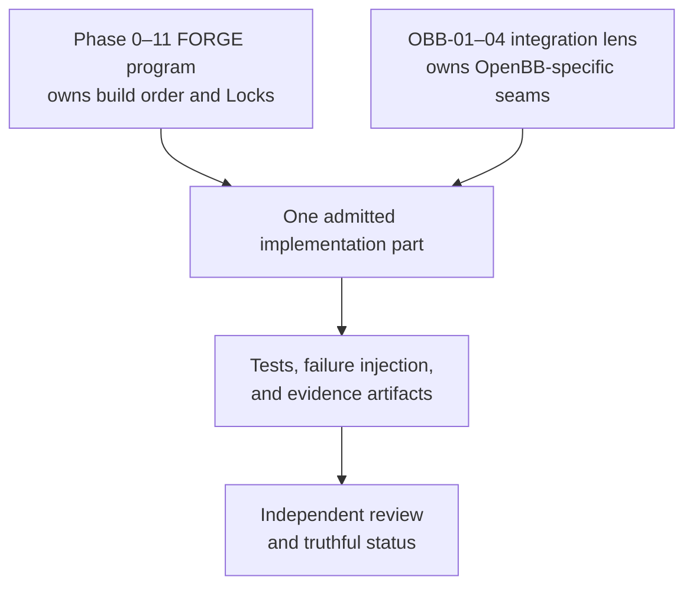

# OBB Build and Integration Plan

> **Purpose:** Plan OpenBB integration following One Build principle  
> **Status:** Draft - Planning in progress  
> **Created:** 2026-08-01  
> **Alignment:** FINAL-ANCHOR-AND-BUILD-GUIDELINE.md

## Overview

Per FINAL-ANCHOR governance: "One Build, Not Two" - The Phase 0–11 FORGE program is the canonical build order; OBB-01 through OBB-04 are the OpenBB integration lens applied to that same build.

**Key Principle:** OBB does not create a second orchestration spine, parallel status system, or shortcut around Phase Locks. It names the OpenBB-specific seams that must be designed and proven as the existing FORGE program progresses.

---

## Current Phase 0 Status

### Completed Evidence Available for OBB Consumption

**Phase 0 Book 1 - Workspace Inventory:**
- ✅ Part 1: Repository fingerprint and core components (12/12 tests)
- ✅ Part 2: Trading census, dependencies, data metadata (10/10 tests)
- ✅ Part 3: Claims, secrets, contradictions (9/9 tests)
- ✅ Part 4: Canonical merge and book gate (8/8 tests)
- **Total:** 49/49 tests passing, 58 Phase 0 tests total
- **Artifacts:** 1,223 documents scanned, 14,032 claims, 759 secrets, 170,702 contradictions

**Phase 0 Book 2 - Reproducible Baseline:**
- ✅ Environment fingerprinting (9/9 tests)
- ⏳ Test command discovery (pending)
- ⏳ Bounded test execution (pending)
- ⏳ Service readiness verification (pending)
- ⏳ Backtest reproduction (pending)

**Phase 0 Books 3-4:**
- ⏳ Component classification (pending human decisions)
- ⏳ Reality lock (pending human decisions)

---

## OBB Integration Strategy

### OBB as Integration Lens (Not Separate Program)

### OBB Seams Definition

An OBB seam exists where OpenBB integration touches FORGE components:

1. **Data Provider Seam** - OpenBB as data source adapter
2. **Research Workspace Seam** - OpenBB Workspace as analyst cockpit
3. **Provider Normalization Seam** - Data format standardization
4. **Catalog/Query Seam** - Provider discovery and metadata
5. **API Boundary Seam** - FORGE adapter to OpenBB API

---

## OBB-01: Truth and Seam Lock

### Relationship to Phase 0

**OBB-01 Book 1: Implementation Reality Audit**

Per FINAL-ANCHOR: "OBB-01 Book 1 must consume and reconcile Phase 0 inventory evidence; it must not duplicate an audit tool under a new name."

### Implementation Strategy

**Step 1: Consume Phase 0 Evidence**
- Use existing Part 1 inventory: repository-fingerprint.json
- Use existing Part 2 census: trading-file-census.json, dependency-inventory.json
- Use existing Part 3 claims: claims-secrets-inventory.json
- Do NOT create new inventory tool

**Step 2: Identify OBB-Relevant Components**
- From Phase 0 inventory, identify components that could interact with OpenBB:
  - Data ingestion paths
  - Research/analysis tools
  - Provider adapters
  - Catalog/metadata systems

**Step 3: Create Capability Matrix**
- Map identified components to OBB capabilities:
  - Which components currently provide what OpenBB could provide?
  - Which components use data OpenBB could provide?
  - Where are the integration seams?

**Step 4: Generate Module Inventory**
- Use Phase 0 evidence to list relevant modules
- Identify OpenBB-specific modules needed
- Define dependency relationships

**Step 5: Create Simulation Debt Register**
- Document where simplified/simulated data exists
- Identify where OpenBB real data could replace simulations
- Record data quality debt

### Deliverables

- `obb-seam-inventory.json` - Components with OBB relevance
- `capability-matrix.json` - Current vs potential OpenBB capabilities
- `module-inventory.json` - OpenBB-relevant modules
- `simulation-debt-register.json` - Simulation debt catalog

### Status

**Prerequisites:**
- Phase 0 Book 1 complete ✅
- Phase 0 Book 2 baseline (partial) ✅
- Phase 0 Reality Lock ❌ (blocked by human decisions)

**Recommended:** Begin OBB-01 planning in parallel with Phase 0 Books 2-4, using available Phase 0 evidence as input.

---

## OBB-02: OpenBB Foundation

### Relationship to Phase 0

**Prerequisite:** Phase 0 Reality Lock
**Dependency:** OBB-01 Truth and Seam Lock

### Implementation Strategy

**Step 1: Install OpenBB**
- Add OpenBB to dependency management
- Configure provider access (read-only)
- Test basic connectivity

**Step 2: Create FORGE Adapter**
- Design adapter layer between FORGE and OpenBB
- Implement data normalization
- Create error handling and fallbacks

**Step 3: Data Provenance**
- Implement DatasetManifest per FINAL-ANCHOR
- Record provider, parameters, times, normalization version
- Ensure point-in-time historical capability

**Step 4: Provider Management**
- Configure provider credentials (OCE-controlled)
- Implement rate limiting and timeout handling
- Create provider catalog

### Authority Boundaries

**Forbidden:**
- OpenBB cannot replace OCE as orchestration spine
- OpenBB Workspace cannot be execution console
- No broker routing through OpenBB
- No capital authority through OpenBB

**Allowed:**
- OpenBB as read-only data provider
- OpenBB Workspace as research cockpit
- FORGE adapter as controlled integration layer

---

## OBB-03: Agent Research and Discovery

### Relationship to Phase 0

**Prerequisite:** OBB-02 Foundation
**Dependency:** Phase 0 agent classification

### Implementation Strategy

**Step 1: Research Agent Integration**
- Integrate OpenBB data access into research agents
- Implement typed research outputs (fact, source, inference, uncertainty)
- Fail closed on malformed output

**Step 2: Discovery Pipeline**
- Use OpenBB for market discovery
- Catalog providers and data types
- Create provider quality metrics

**Step 3: Research Workspace**
- Integrate OpenBB Workspace with FORGE research flow
- Ensure workspace is analyst cockpit only
- No execution authority from workspace

### Authority Boundaries

**Forbidden:**
- Research agents cannot qualify strategies
- Research agents cannot approve deployment
- Research agents cannot access execution adapters

**Allowed:**
- Research agents can propose strategies
- Research agents can generate evidence
- Research agents can rank candidates

---

## OBB-04: Quant Validation and Operations

### Relationship to Phase 0

**Prerequisite:** OBB-03 Agent Research
**Dependency:** Phase 0 canonical Nautilus classification

### Implementation Strategy

**Step 1: Validation Integration**
- Use OpenBB data for Nautilus validation
- Implement backtest data provenance
- Ensure validation uses point-in-time data

**Step 2: Operations Integration**
- Paper mode through OCE (not OpenBB)
- Shadow mode with reconciliation
- No live routing through OpenBB

**Step 3: Quality Assurance**
- Data quality monitoring
- Provider reliability tracking
- Failover and recovery

### Authority Boundaries

**Forbidden:**
- No live execution through OpenBB
- No paper mode without OCE approval
- No capital allocation through OpenBB

**Allowed:**
- Read-only data for validation
- OCE-controlled paper operations
- Audit trail for all operations

---

## Implementation Phases

### Phase A: Planning (Current - Allowed)
- ✅ Phase 0 Book 1 Parts 1-4 complete (implemented_unverified)
- ✅ Safe defaults applied to Phase 0 decisions
- ✅ OBB integration strategy defined
- ⏳ OBB-01 detailed planning (can proceed now)

**Note:** OBB planning is NOT gated by Phase 0 completion. Only OBB runtime/canonical integration is gated by relevant Phase 0–3 locks.

### Phase B: OBB-01 Implementation (After Phase 0 Lock)
- Consume Phase 0 evidence
- Create OBB seam inventory
- Generate capability matrix
- Document simulation debt
- **Gate:** Phase 0 Reality Lock

### Phase C: OBB-02 Foundation (After Phase 1-3 Locks)
- Install OpenBB
- Create FORGE adapter
- Implement data provenance
- Configure provider management
- **Gate:** Phase 1-3 data/runtime completion

### Phase D: OBB-03 Agent Research (After OBB-02)
- Integrate research agents
- Build discovery pipeline
- Connect research workspace
- **Gate:** OBB-02 foundation

### Phase E: OBB-04 Validation (After Phase 6-8 Locks)
- Integrate validation pipeline
- Implement operations mode
- Quality assurance
- **Gate:** Phase 6-8 strategy/validation completion

---

## Decision Points

### Decision OBB-1: OpenBB Installation Strategy
**Question:** How to install and manage OpenBB dependency?  
**Safe Default:** Add to main dependency management behind FORGE adapter  
**Decision Maker:** OCE Operations Director  
**Approval Required:** No (safe default)

### Decision OBB-2: Provider Configuration
**Question:** Which OpenBB providers to configure?  
**Safe Default:** Selected providers based on need (not all)  
**Decision Maker:** OCE Operations Director  
**Approval Required:** No (safe default)

### Decision OBB-3: Adapter Architecture
**Question:** FORGE-OpenBB adapter architecture?  
**Safe Default:** Service layer (consistent with FORGE adapter pattern)  
**Decision Maker:** OCE Operations Director  
**Approval Required:** No (safe default)

---

## Next Actions

1. **Immediate:** Begin OBB-01 detailed planning using available Phase 0 evidence
2. **Parallel:** Continue Phase 0 Books 2-4 with human decision gates
3. **Coordination:** Align OBB timing with Phase 0 Reality Lock
4. **Documentation:** Create OBB-01 implementation plan document
5. **Approval:** Present OBB strategy to MAD for approval

---

## Risk Assessment

### High Risks
- **Phase 0 Reality Lock Delay:** Blocks OBB-02+ runtime integration (not OBB-01 planning)
- **Provider Access:** May require credentials/approval
- **Architecture Conflicts:** FORGE-OpenBB integration complexity

### Medium Risks
- **Data Quality:** OpenBB data may not meet FORGE standards
- **Performance:** Provider latency impacts
- **Dependency Drift:** OpenBB updates breaking integration

### Mitigation
- OBB-01 planning can proceed now (not gated by Phase 0 completion)
- OBB-02+ runtime integration gated by relevant Phase locks
- Clearly define authority boundaries (per FINAL-ANCHOR)
- Implement adapter layer for flexibility
- Create fallback mechanisms

---

**Status:** OBB strategy defined. Ready for OBB-01 detailed planning.